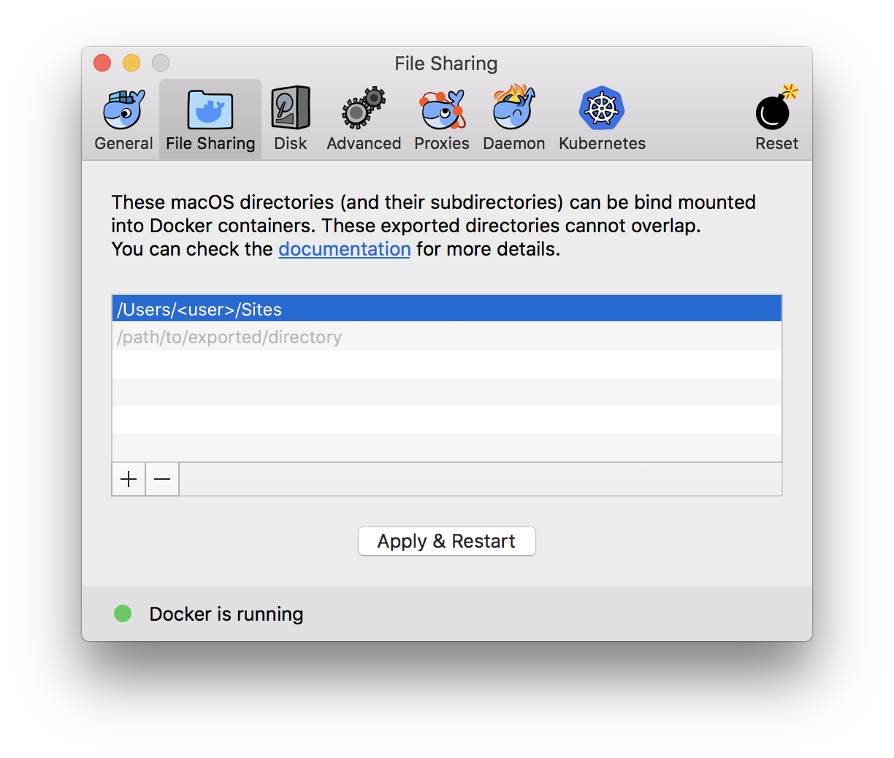

# Magento 2 Dockergento

[](juan.jalogut@gmail.com)

## Motivation

This project aims to offer a good performance solution for MAC users that want to use docker on development.
This is a docker setup optimised for Magento2 on Mac. It has same performance as Linux or local setups.

## Main Features

### Overcome Docker for Mac performance issues on Magento 2

* Use docker volumens for following directories:

	* vendor
	* generated
	* var
	* pub/static
	* pub/media

* Sincronise `vendor` and `generated` using a specific `sync` container. See [Sync vendor & generated section](#sync)

<details>
<summary>Docker for Mac performance issues</summary>

From docker for mac documentation: https://docs.docker.com/docker-for-mac/troubleshoot/#known-issues

There are a number of issues with the performance of directories bind-mounted with osxfs. In particular, writes of small blocks, and traversals of large directories are currently slow. Additionally, containers that perform large numbers of directory operations, such as repeated scans of large directory trees, may suffer from poor performance. Applications that behave in this way include:

rake
ember build
Symfony
Magento
Zend Framework
PHP applications that use Composer to install dependencies in a vendor folder

As a work-around for this behavior, you can put vendor or third-party library directories in Docker volumes, perform temporary file system operations outside of osxfs mounts, and use third-party tools like Unison or rsync to synchronize between container directories and bind-mounted directories. We are actively working on osxfs performance using a number of different techniques. To learn more, see the topic on Performance issues, solutions, and roadmap.

</details>

## Preconditions

1. Configure your docker `File Sharing` settings

	

2. Optionally apply these performance tweaks

	* [http://markshust.com/2018/01/30/performance-tuning-docker-mac](http://markshust.com/2018/01/30/performance-tuning-docker-mac)

## Installation

1. Copy this docker configuration repository in your project

	```
	curl -L https://api.github.com/repos/ModestCoders/magento2-dockergento/tarball | tar xz --strip=1
	```

2. Edit your magento paths or nginx configuration if needed

## Usage

### Start Application

```
docker-compose up app
docker-compose exec phpfpm composer install
sudo vim /etc/hosts
// Add -> 127.0.0.1 <your-domain>
```

### Execute Magento commands

Magento commands must be executed inside the `php` container

```
docker-compose exec phpfpm bash
```

### <a name="sync"></a> Sync vendor and generated

There are 2 options to sync the volumes `vendor` and `generated`

#### Option 1: One time sync

This option must be used most of the times. You should only need to sync `vendor` and `generated` from time to time for debugging purposes

```
docker-compose exec sync sh -c "sync -path <path_to_sync>"
```

**NOTE:** `<path_to_sync>` should be `vendor` or `generated`. For faster and more specific syncs, you can include the subfolder path inside `vendor` like `sync -path vendor/<company_name>`.

#### Option 2: Watch

This option is only recommended if you are implementing code in a vendor module.

```
docker-compose exec sync sh -c "watch -path <path_to_sync>"
```

Example: `docker-compose exec sync sh -c "watch -path vendor/<company_name>/<module_name>"`

### Frontend

1. Start node container

	```
	docker-compose up node
	```

2. NPM config setup (Only first time)

	```
	docker-compose exec node bash
	cp package.json.sample package.json && cp Gruntfile.js.sample Gruntfile.js
	npm install
	```

3. Grunt watch

	```
	docker-compose exec node bash
	grunt exec:<theme>
	grunt watch
	```

## ChangeLog

[CHANGELOG.md](CHANGELOG.md)

## Developers

* [Juan Alonso](https://github.com/jalogut)
* [Daniel Lozano](https://github.com/danielozano)
* [Contributors](https://github.com/ModestCoders/magento2-dockergento/graphs/contributors)

## Resources

This project has been possible thanks to the following resources:

* [docker-magento](https://github.com/markoshust/docker-magento) by [@markshust](https://twitter.com/markshust)
* [Getting Started with Docker for Magento](https://nomadmage.com/product/getting-started-with-docker-for-magento-2/) by [@mostlymagic](https://twitter.com/mostlymagic)

## Licence

[GNU General Public License, version 3 (GPLv3)](http://opensource.org/licenses/gpl-3.0)

## Copyright
(c) ModestCoders