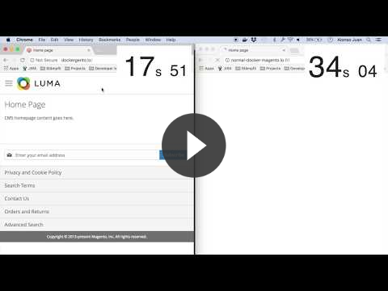

# Magento 2 Dockergento

[](juan.jalogut@gmail.com)

## Performance Comparison

#### Up to 10x faster development experience on OSX

<a href="https://youtu.be/sGmXc_lzTNM" target="_blank">
  
</a>

#### Check out all benchmarks

* [Benchmarks: Dockergento vs Standard Docker](docs/benchmarks.md)

## Motivation

This project aims to offer a good performance solution for Mac users that want to use docker on development.
This is a docker setup optimised for Magento 2 on Mac. It has same performance as Linux or local setups.

## Main Features

### Overcome Docker for Mac performance issue

<details>
<summary>Open to read issue explanation</summary>

From docker for mac documentation: https://docs.docker.com/docker-for-mac/troubleshoot/#known-issues

There are a number of issues with the performance of directories bind-mounted with osxfs. In particular, writes of small blocks, and traversals of large directories are currently slow. Additionally, containers that perform large numbers of directory operations, such as repeated scans of large directory trees, may suffer from poor performance. Applications that behave in this way include:

* rake
* ember build
* Symfony
* Magento
* Zend Framework
* PHP applications that use Composer to install dependencies in a vendor folder

As a work-around for this behavior, you can put vendor or third-party library directories in Docker volumes, perform temporary file system operations outside of osxfs mounts, and use third-party tools like Unison or rsync to synchronize between container directories and bind-mounted directories. We are actively working on osxfs performance using a number of different techniques. To learn more, see the topic on Performance issues, solutions, and roadmap.

</details>

**Solution:**

* Set full magento app inside a named volume `magento`
* Synchronise only git repository files between host and container.
* Everything else is not synchronised, so performance is same as in local setups.

**How do you get the code that is not synchronised in your host?**

Even if not synchronised, it is needed to have magento and vendor code in your host. Not only for developing but also for xdebug.

To sync that code seamlessly, [magento2-dockergento-console](https://github.com/ModestCoders/magento2-dockergento-console) uses `docker cp` automatically when you execute relevant commands like `dockergento composer` or `dockergento start`, so you do not need to care about that.

On the other hand, for those that implement modules inside vendor, we also provide a `unison` container that watches and syncs changes in background when you develop inside vendor.

See [dockergento workflow](#workflow) for a better understanding about whole development process with dockergento.

## Preconditions

1. Configure your docker `File Sharing` settings

	
	
	NOTE: You do not need to have `Composer` installed. You only need to create a `.composer` folder in your computer, so it can be used by containers to cache composer dependecies instead of downloading them everytime.

2. Optionally you can also apply these performance tweaks

	* [http://markshust.com/2018/01/30/performance-tuning-docker-mac](http://markshust.com/2018/01/30/performance-tuning-docker-mac)

## Installation

1. Copy this docker configuration repository in your project

	```
	cd <path_to_your_project>
	curl -L https://api.github.com/repos/ModestCoders/magento2-dockergento/tarball | tar xz --strip=1
	```

2. Edit binded paths or nginx configuration if needed

	<details>
	<summary>More info about custom configurations</summary>
	
	**Binded Paths:**
	
	If you install magento code in a different folder than your project root, you might need to replace `<magento_dir>` on the following files: 
	
	* `docker-compose.yml`
	
	```
	app-volumes:
		build: ./config/docker/image/app-volumes
		volumes: &appvolumes
            - ~/.composer:/var/www/.composer:delegated
            - sockdata:/sock
            - magento:/var/www/html/<magento_dir>
            - ./app:/var/www/html/<magento_dir>/app:delegated
            - ./.git:/var/www/html/.git:delegated
            - ./config:/var/www/html/config:delegated
            - ./composer.json:/var/www/html/composer.json:delegated
            - ./composer.lock:/var/www/html/composer.lock:delegated
            # Add here the rest of files and folders in your git repository that you want to bind between host and container

	unison:
		image: modestcoders/unison:2.51.2
		volumes:
            - magento:/var/www/html/<magento_dir>
            - ./<magento_dir>/vendor:/sync/<magento_dir>/vendor
		environment:
  			- SYNC_SOURCE_BASE_PATH=/sync/<magento_dir>
  			- SYNC_DESTINATION_BASE_PATH=/var/www/html/<magento_dir>
  			- SYNC_MAX_INOTIFY_WATCHES=60000
	```
	
	* `config/docker/image/app-volumes/Dockerfile`
	
	```
	RUN mkdir -p /var/www/html/<magento_dir> && chown -R 1000:1000 /var/www/html
	```	
	
	* `config/docker/image/nginx/conf/default.conf`
	
	```
	server {
		# ...
		set $MAGE_ROOT /var/www/html/<magento_dir>;
		# ...
	```
	
	**Nginx Multi-store:**
	
	If you have a multi-store magento, you need to add your website codes to the ngnix configuration as follows:  
	
	* `config/docker/image/nginx/conf/default.conf`
	
	```
	# WEBSITES MAPPING
	map $http_host $MAGE_RUN_CODE {

		default    base;
		## For multi-store configuration add here your domain-website codes
		dominio-es.lo    es;
		dominio-ch.lo    ch;
		dominio-de.lo    de;
	}
	```
	</details>

3. Install [magento2-dockergento-console](https://github.com/ModestCoders/magento2-dockergento-console) 

## Usage

### Video Demos

<a href="https://www.youtube.com/watch?v=rtr8waq7DHo&list=PLBt8dizedSZBhcjTL8SM2PS2HEy0mFf5F" target="_blank">
  
</a>

### Start Application

```
dockergento start
dockergento composer install
sudo vim /etc/hosts
// Add -> 127.0.0.1 <your-domain>
```

### <a name="workflow"></a> Workflow

See detailed documentation about development workflow with dockergento

* `magento2-dockergento-console` > [Development Workflow](https://github.com/ModestCoders/magento2-dockergento-console/blob/master/docs/workflow.md)

## Xdebug

* [PHPStorm + Xdebug Setup](docs/xdebug_phpstorm.md)

## Grumphp

* [Grumphp Setup](docs/grumphp_setup.md)

## Docker Images

* [Docker Images List](docs/docker_images.md)

## Troubleshooting

### Named volumes suddenly bind to host

There is bug in docker that causes volumes to stop working and start behaving like a bind mount. If you notice a performance decrease, try the following:

* `dockergento volumes-check`

In case of confirmation that volumes are broken, restart dockergento:

* `dockergento restart`

**NOTE**: if volumes are still broken after restarting, you need to restart the docker app :(

## ChangeLog

* [CHANGELOG.md](CHANGELOG.md)

## Developers

* [Juan Alonso](https://github.com/jalogut)
* [Daniel Lozano](https://github.com/danielozano)
* [Contributors](https://github.com/ModestCoders/magento2-dockergento/graphs/contributors)

## Resources

This project has been possible thanks to the following resources:

* [docker-magento](https://github.com/markoshust/docker-magento) by [@markshust](https://twitter.com/markshust)
* [Getting Started with Docker for Magento](https://nomadmage.com/product/getting-started-with-docker-for-magento-2/) by [@mostlymagic](https://twitter.com/mostlymagic)
* [Docker Background Sync](https://github.com/cweagans/docker-bg-sync) by [@cweagans](https://twitter.com/cweagans)

## Licence

[GNU General Public License, version 3 (GPLv3)](http://opensource.org/licenses/gpl-3.0)

## Copyright
(c) ModestCoders
