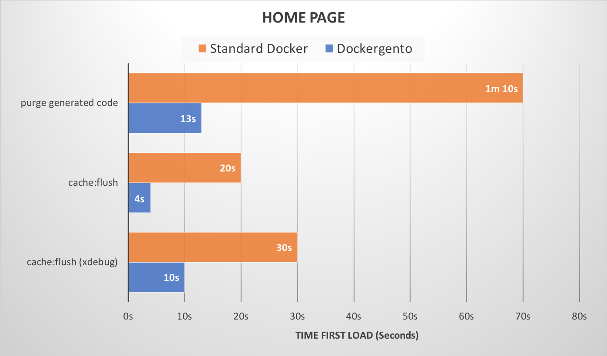
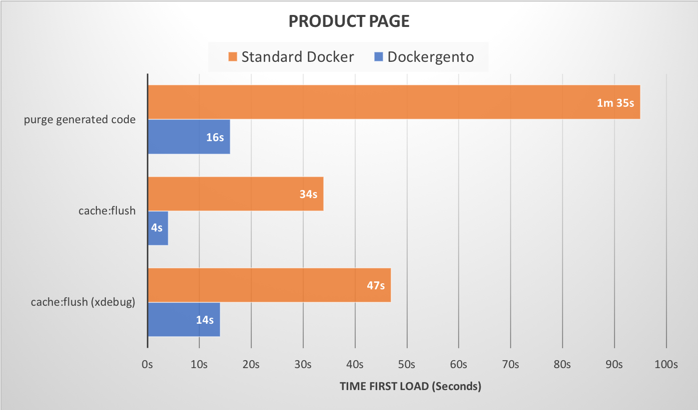
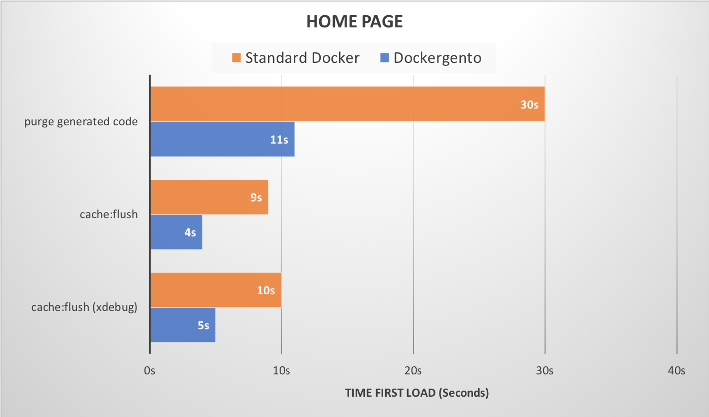
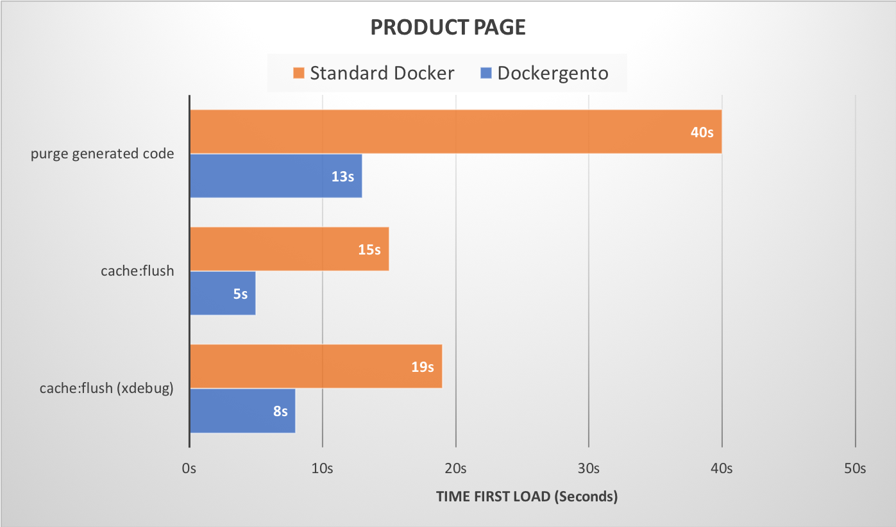

# Benchmarks

## Specifications

* **Computer:** macOs Sierra 10.12.6, i7 - 3.1 GHz, 16GB RAM
* **Docker version:** 18.06.1-ce-mac73
* **Magento mode:** developer
* **Data:** luma theme with magento sample data
* **PHP version:** 7.1

## Charts (Shorter is better)

Performance is different depending on how busy your computer is. 

Because of that we have made 2 different benchmarks:

1. Apps needed for development running
2. Only Docker and Chrome running

### 1. Apps needed for development running

* **Apps running:** PHPStorm, Sequel Pro, Outlook, Slack, Chrome, Docker

### 2. Only Docker and Chrome running

* **Apps running:** Chrome, Docker

