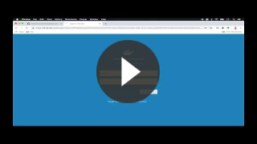
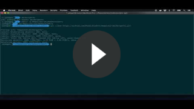
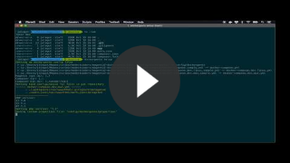
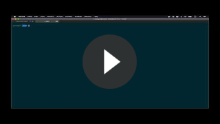
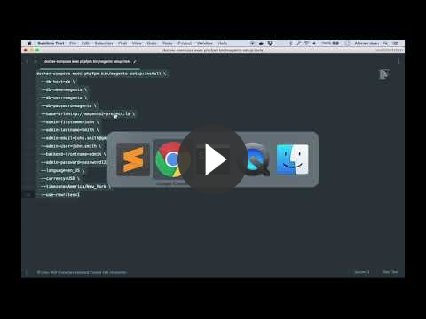
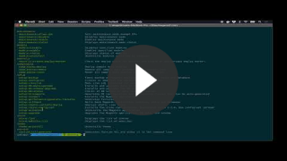
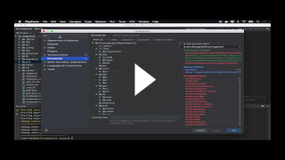
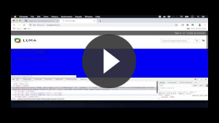
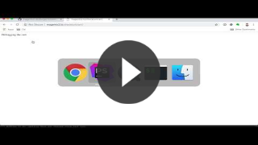

# Video Tutorials

[Full Youtube Playlist](https://www.youtube.com/watch?v=qdUBuDCzHaA&list=PLBt8dizedSZBhcjTL8SM2PS2HEy0mFf5F)

## Install Docker

### Docker for Mac

## Install Dockergento Console

## Project Setup

Depending the type of project, you can use one of the following setups:

### Dockerize existing project

### Setup New Project

## Magento Install

### Magento wizard install

### Magento setup:install

## Magento console

## Xdebug

## Working on frontend

## Working on Vendor (Mac only)

