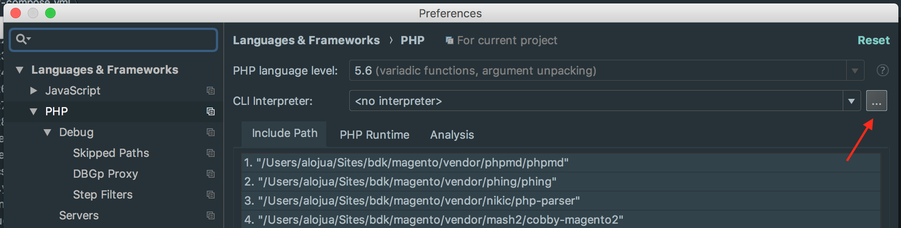
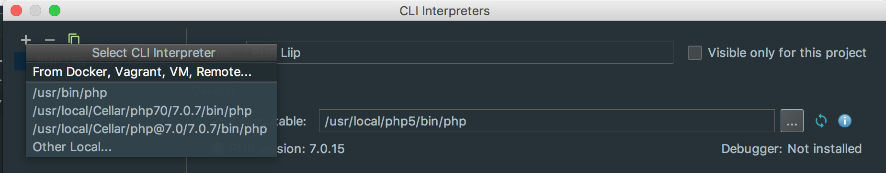
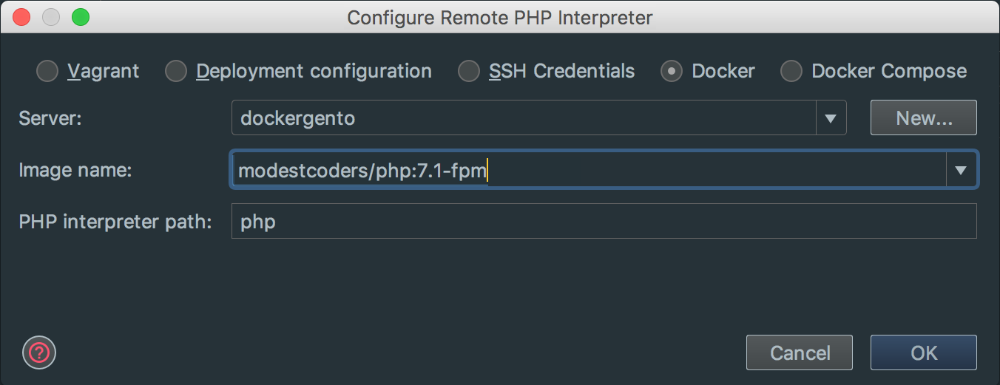
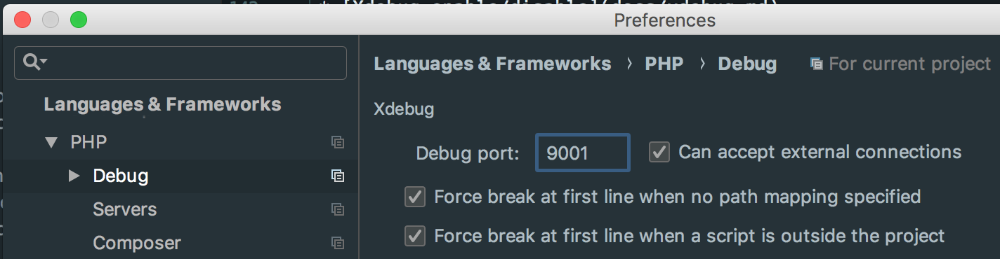
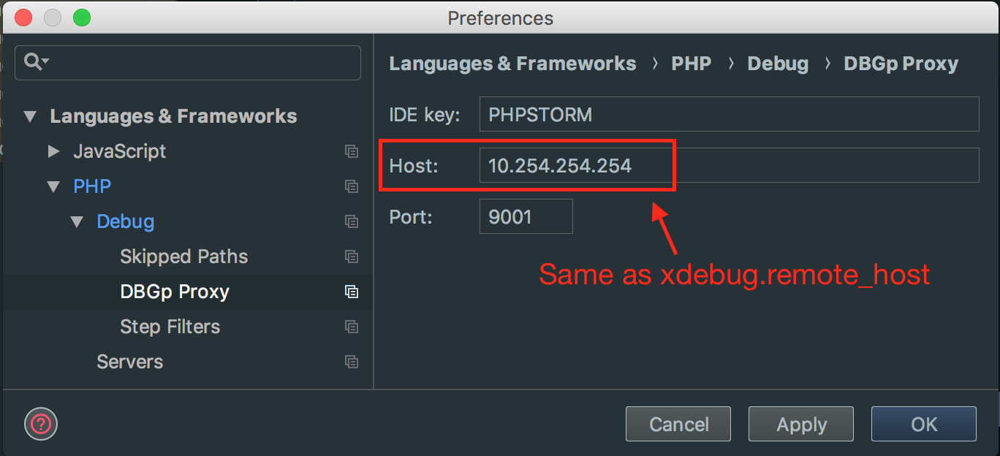
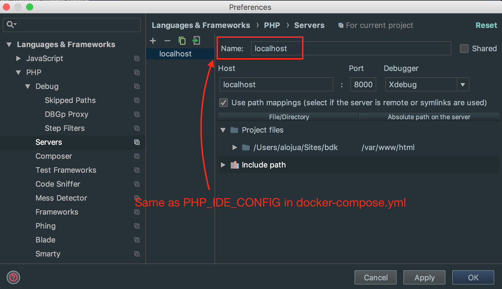
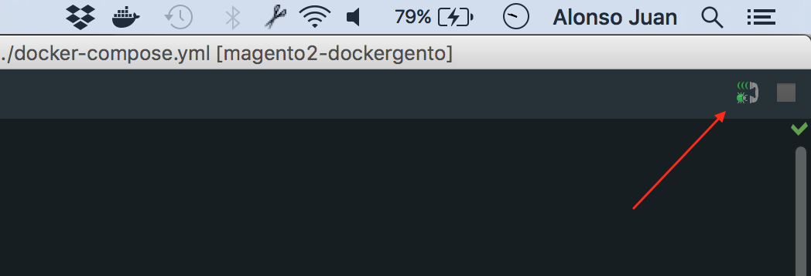
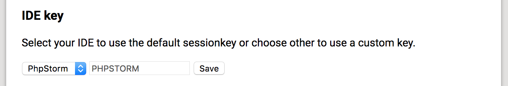
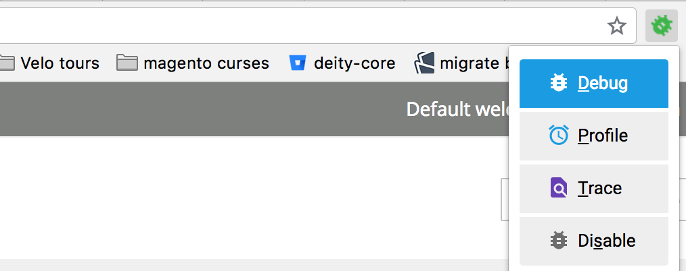

# PHPStorm + Xdebug Setup

## Configuration Steps

1. `Build, Execution, Deployment > Docker`

	* Add new docker profile (i.e dockergento)

2. `PHPStorm > Preferences > Languages & Frameworks > PHP`

	* Add new CLI interpreter

	
	
	* Select CLI Interpreter from Docker

	
	
	* Select `phpfpm` docker image

	

3. `PHPStorm > Preferences > Languages & Frameworks > PHP > Debug`	
	* Debug Port: 9001

	

4. `PHPStorm > Preferences > Languages & Frameworks > PHP > Debug > DBGp Proxy`

	* Host must match with the `REMOTE_HOST_IP` set on the [Xdebug configuration](xdebug.md)

	

5. `PHPStorm > Preferences > Languages & Frameworks > PHP > Servers`

	* Name: `localhost` (Same as `PHP_IDE_CONFIG` in `docker-compose.yml`)
	* Port: 8000
	* Mapping: `/Users/<username>/Sites/<project> -> /var/www/html`

	
	
6. Start Listening for PHP Debug connections

	**NOTE**: Be sure to activate that only after setting the right debug port. Changes in Debug port are ignored once the listener has started.
	
	

	
7. Install and enable `Xdebug helper` plugin in Chrome

	* [https://chrome.google.com/webstore/detail/xdebug-helper](https://chrome.google.com/webstore/detail/xdebug-helper/eadndfjplgieldjbigjakmdgkmoaaaoc)
	
	
	

	
	
	
	