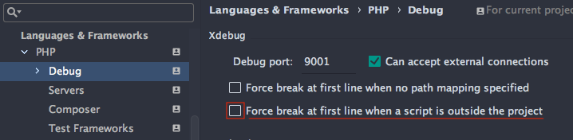

# PHPStorm + Xdebug Setup

## Enable Xdebug

Xdebug needs to be enabled inside the `phpfpm` container. 

```
dockergento debug-on
```

## PHPStorm configuration

1. `PHPStorm > Preferences > Languages & Frameworks > PHP > Debug`	
	* Debug Port: 9001

	

2. `PHPStorm > Preferences > Languages & Frameworks > PHP > Servers`

	* Name: `localhost` (Same as `PHP_IDE_CONFIG` in `docker-compose.yml`)
	* Port: 8000
	* Mapping: `/Users/<username>/Sites/<project> -> /var/www/html`

	
	
3. Start Listening for PHP Debug connections

	**NOTE**: Be sure to activate that only after setting the right debug port. Changes in Debug port are ignored once the listener has started.
	
	

4. Install and enable `Xdebug helper` plugin in Chrome

	* [https://chrome.google.com/webstore/detail/xdebug-helper](https://chrome.google.com/webstore/detail/xdebug-helper/eadndfjplgieldjbigjakmdgkmoaaaoc)
	
	
	

	
	
	
	
